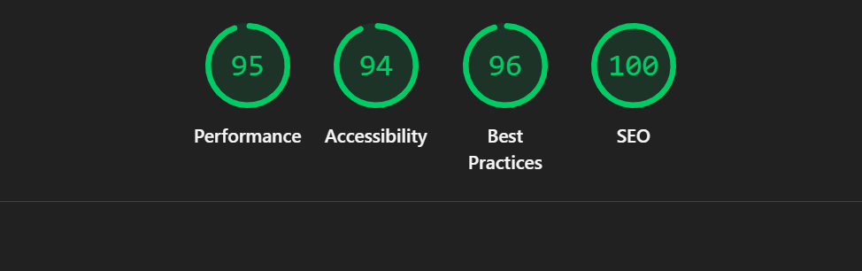
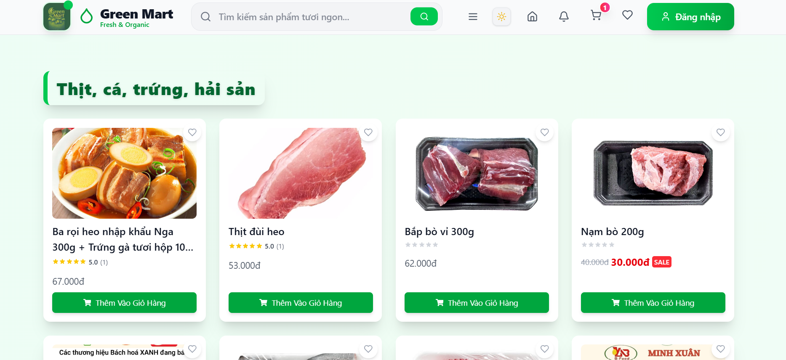
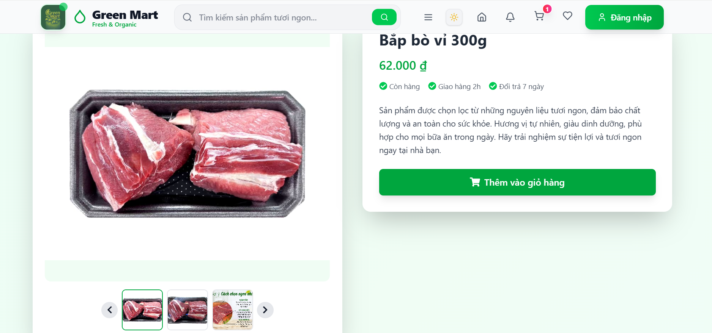
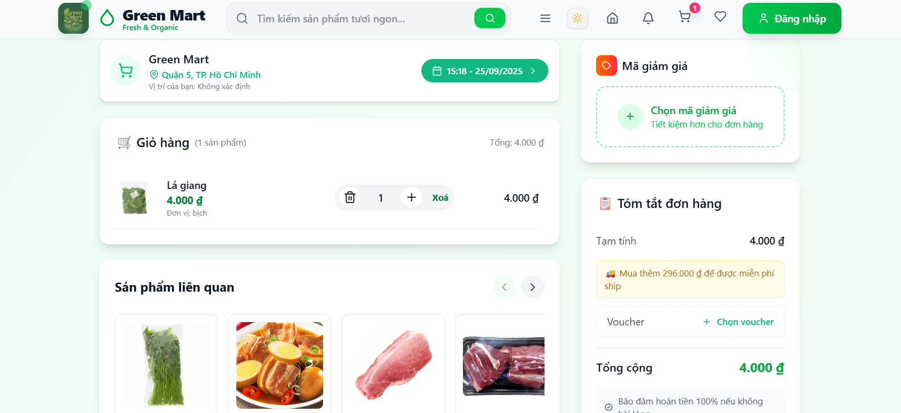
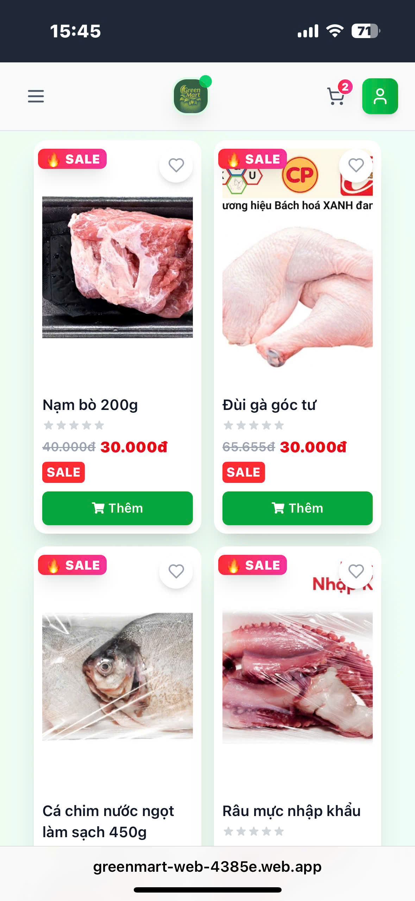
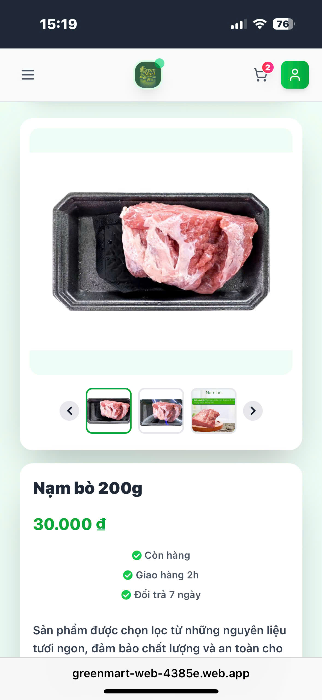
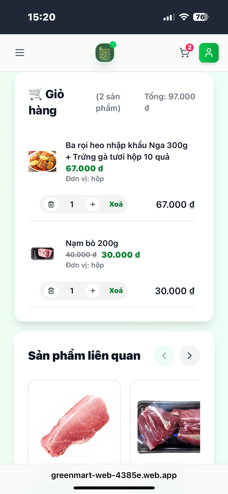
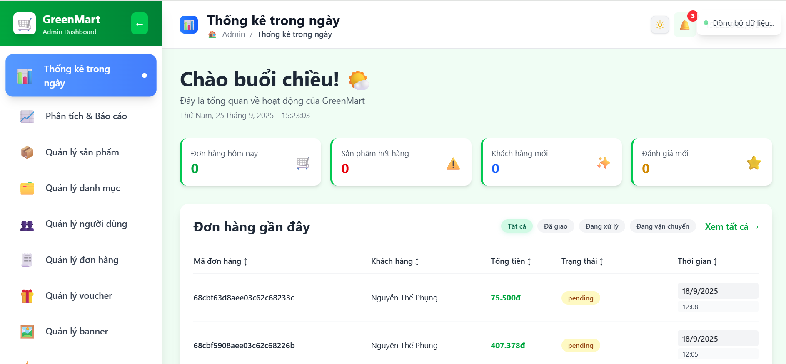

# 🛒 GreenMart - Fresh & Organic E-commerce Platform

<div align="center">
  
  
  [](https://greenmart-web-4385e.web.app/)
</div>

<!-- Lighthouse report preview -->
<div align="center" style="margin-top:16px;">
  <a href="./frontend/public/sreenshot/lighthouse.png" target="_blank">
    
  </a>
  <p style="font-size:0.95rem; color:#555; margin-top:8px;">Lighthouse audit</p>
</div>

## 👨‍💻 Author
**Nguyễn Thể Phụng** - [nguyenthephung61@gmail.com](mailto:nguyenthephung61@gmail.com)

## 🌟 Live Demo
**🔗 [https://greenmart-web-4385e.web.app](https://greenmart-web-4385e.web.app)**

## 📖 About
GreenMart is a modern fullstack e-commerce platform for fresh and organic products, built with React + TypeScript (Frontend) and Node.js + MongoDB (Backend).

## 🚀 Quick Start

### Prerequisites
- Node.js (v18+), MongoDB, npm

### Installation & Run
```bash
# Clone and install
git clone https://github.com/nguyenthephung/Green-Mart.git
cd Green-Mart
npm install

# Setup environment files
# Backend: Create backend/.env with MONGODB_URI, JWT_SECRET, CLOUDINARY config
# Frontend: Create frontend/.env with VITE_API_URL=http://localhost:5000/api

# Run both frontend & backend
npm run dev
```

**Access:** Frontend: http://localhost:5173 | Backend: http://localhost:5000

## 🛠️ Tech Stack
**Frontend:** React 18, TypeScript, Vite, Tailwind CSS, Zustand  
**Backend:** Node.js, Express, MongoDB, JWT, Cloudinary  
**Tools:** ESLint, Prettier, Docker

## ✨ Features

### 🛍️ **E-commerce Core**
- Product catalog with categories
- Advanced search and filtering
- Shopping cart and wishlist
- Secure checkout process
- Multiple payment methods
- Order tracking system

### 🎨 **User Experience**
- **Mobile-first responsive design** - Fully optimized for mobile devices
- **Dark/Light theme toggle** - Available in both desktop and mobile interfaces
- **Mobile dropdown navigation** - Hamburger menu with theme toggle integration
- **Responsive notification system** - Mobile-optimized notification modal
- **Scroll-to-top functionality** - Automatic page scroll restoration
- Real-time notifications
- Loading states and animations
- Error handling and validation
- Optimized performance

### 🔐 **IC/ID Authentication System**
- **Identity Card (IC/ID) integration** - Support for national ID verification
- **Multi-level user authentication** - Guest, Registered, and Admin roles
- JWT-based secure authentication
- Password hashing with bcrypt
- Protected routes and authorization
- Input validation and sanitization
- CORS protection

### 📱 **Mobile-Responsive Features**
- **Adaptive address management** - Mobile-optimized address forms and layouts
- **Responsive grid layouts** - Dynamic column adjustments for different screen sizes
- **Touch-friendly interfaces** - Optimized button sizes and touch targets
- **Mobile cart and checkout** - Streamlined mobile shopping experience
- **Notification badge positioning** - Properly aligned count badges on mobile icons

### 🔒 **Security & Authentication**
- JWT-based authentication
- Password hashing with bcrypt
- Protected routes and authorization
- Input validation and sanitization
- CORS protection

### 📊 **Admin Dashboard**
- Real-time analytics
- Sales and revenue tracking
- User activity monitoring
- Inventory management
- Content management system

---

## 👥 User Roles 

### 🔓 **Guest User**
- Browse products and categories
- View product details
- Search and filter products
- View flash sales and promotions
- Access public pages (About, Policy, etc.)

### 👤 **Registered User** 
- All guest features plus:
- User authentication (login/register)
- Shopping cart management
- Checkout and order placement
- Order tracking and history
- Wishlist management
- User profile management
- Address and payment method management
- Voucher and discount usage

### 👑 **Admin User**
- All user features plus:
- Product management (CRUD operations)
- Category management
- User management
- Order management and tracking
- Banner and promotion management
- Voucher/discount creation
- Flash sale management
- Analytics dashboard
- System notifications

## 📸 Screenshots

### Screenshots overview

| Homepage (Desktop) | Product (Desktop) |
|---:|:---|
|  <br/> *Homepage — Desktop view* |  <br/> *Product detail — Desktop view* |

| Cart (Desktop) |  |
|---:|:---|
|  <br/> *Shopping cart — Desktop view* | |

| Mobile — Homepage | Mobile — Product |
|:---:|:---:|
|  |  |

| Mobile — Cart |  |
|:---:|:---:|
|  | |

| Admin Dashboard | Admin Revenue |
|:---:|:---:|
|  <br/> *Admin dashboard — analytics overview* |  <br/> *Revenue & sales — Admin view* |

All screenshots are stored in `frontend/public/sreenshot/`. Click an image to open full-size.

## 🤝 Contributing
1. Fork → Create feature branch → Commit → Push → Pull Request

## 📄 License
MIT License - feel free to use for learning and projects!

---

<div align="center">
  
  
  **Made with ❤️ by Nguyễn Thể Phụng**
  
  ⭐ **Don't forget to give this project a star if you found it helpful!** ⭐
</div>